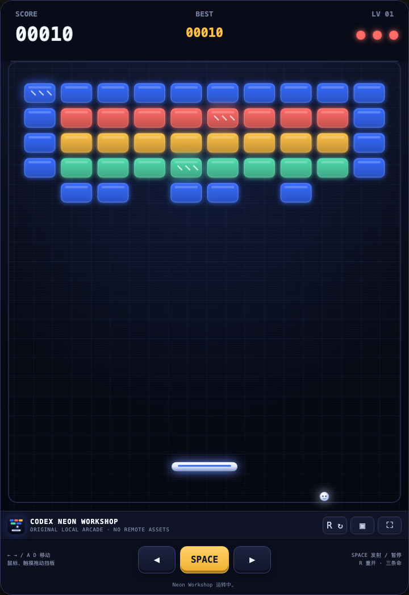
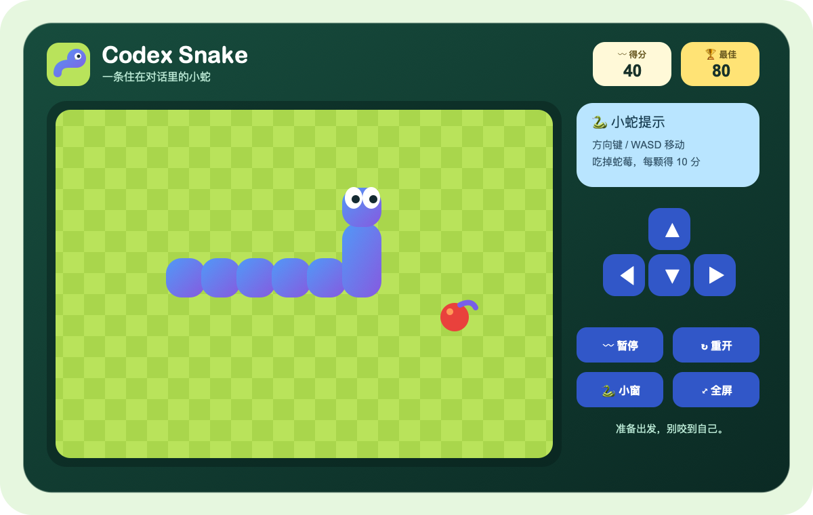
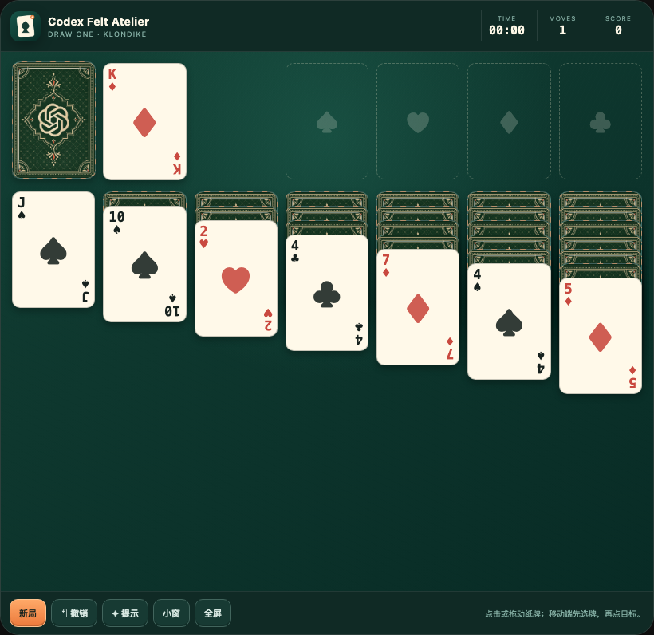

# Codex Arcade · 在 Codex 里开一间小街机厅

Three local-first games for the moments when your agent is thinking very, very hard.

三款开箱即玩的 Codex 游戏。适合等任务跑完时，进行一点克制且不影响生产力统计的摸鱼。

[中文](#中文) · [English](#english) · [安装 Install](#安装--install) · [游戏 Games](#游戏--games) · [FAQ](#faq)

---

<a id="中文"></a>

## 中文

Codex Arcade 是一个可直接加入 Codex 的插件市场，当前有三款完整可玩的 MCP App：打砖块、贪吃蛇和纸牌接龙。它们都在 Codex 任务中打开，不需要跳到外部游戏网站。

游戏逻辑、界面与素材均随插件保存在本地；运行时不下载远程图片、字体或第三方游戏资源，也没有 npm runtime 依赖。每款游戏由本地 Node.js stdio MCP 服务提供一个自包含的 `text/html;profile=mcp-app` 界面。

<a id="english"></a>

## English

Codex Arcade is a plugin marketplace with three complete MCP App games: Brick Breaker, Snake, and draw-one Klondike Solitaire. Each game opens inside a Codex task—no detour to an external game site required.

Game logic, UI, and artwork ship locally with the plugins. There are no remote images, fonts, third-party game assets, npm packages, or network runtime dependencies. Each plugin uses a local Node.js stdio MCP server to serve a self-contained `text/html;profile=mcp-app` interface.

## 安装 · Install

### 从 GitHub 安装 · Install from GitHub

把公开仓库加入 Codex marketplace，然后安装一款或全部游戏：

Add the public repository as a Codex marketplace, then install one game or all three:

```bash
codex plugin marketplace add nameczz/codex-arcade --ref main

codex plugin add codex-brick-breaker@codex-arcade
codex plugin add codex-snake@codex-arcade
codex plugin add codex-solitaire@codex-arcade
```

### Clone 后本地安装 · Install from a local clone

```bash
git clone https://github.com/nameczz/codex-arcade.git
cd codex-arcade
./scripts/install-local.sh all
```

也可以只安装一款。`both` 为旧参数兼容别名，目前与 `all` 相同。

Install one game at a time if preferred. `both` remains as a backwards-compatible alias for `all`.

```bash
./scripts/install-local.sh brick
./scripts/install-local.sh snake
./scripts/install-local.sh solitaire
./scripts/install-local.sh all
```

安装或更新插件后，请新建一个 Codex 任务，让新的 Skill 与 MCP 工具进入任务上下文。

After installing or updating, start a new Codex task so it picks up the latest Skill and MCP tool.

## 游戏 · Games

### 🧱 Codex Brick Breaker

原创的 “Codex Neon Workshop” 打砖块：三条命、多关卡布局、特殊砖块、连击反馈、粒子效果、计分与本地最佳成绩。支持键盘、鼠标和触摸操作。

An original “Codex Neon Workshop” brick breaker with three lives, multiple layouts, special bricks, combo feedback, particles, scoring, and local best-score persistence. Keyboard, pointer, and touch controls are included.



新任务触发词 · New-task prompts:

- `打开打砖块` / `玩打砖块`
- `Start Brick Breaker` / `Play Breakout`

控制 · Controls:

- `←` `→` 或 `A` `D` 移动挡板；`Space` 发射、暂停或继续；`R` 重开。
- Move with `←` `→` or `A` `D`; press `Space` to launch, pause, or resume; press `R` to restart.
- 鼠标或触摸拖动挡板，移动端也有可见按钮。Drag the paddle with a pointer or touch; visible mobile controls are provided.

### 🐍 Codex Snake

一条住在对话里的原创小蛇，支持分数、最佳成绩、暂停、重开、键盘、滑动与方向按钮。它不读取你的代码，只吃棋盘上的果子。

An original snake that lives inside a conversation, with scoring, best-score persistence, pause, restart, keyboard, swipe, and directional controls. It does not eat your code—only the fruit on its board.



新任务触发词 · New-task prompts:

- `打开贪吃蛇` / `玩贪吃蛇` / `来一局贪吃蛇`
- `Start Snake Game` / `Play Snake`

控制 · Controls:

- 方向键或 WASD 移动；`Space` 暂停或继续；`R` 重开。
- Move with arrow keys or WASD; press `Space` to pause or resume; press `R` to restart.
- 移动端可滑动或使用方向按钮。Swipe or use the on-screen direction buttons on mobile.

### ♠ Codex Solitaire

原创的 “Codex Felt Atelier” draw-one Klondike 纸牌接龙，包含标准 52 张牌、七列发牌、翻牌与重新发牌、四组 Foundation、正确的红黑交替规则、撤销、提示、计时、步数与得分。GPT knot 卡背素材也完全保存在插件内。

An original “Codex Felt Atelier” draw-one Klondike table with a standard 52-card deck, seven tableau columns, stock and redeals, four foundations, correct alternating-color rules, undo, hints, timer, moves, and scoring. Its GPT knot card-back artwork also ships inside the plugin.



新任务触发词 · New-task prompts:

- `打开纸牌接龙` / `玩纸牌接龙` / `来一局接龙`
- `Start Solitaire` / `Play Klondike` / `Play Patience`

控制 · Controls:

- 点击或拖放纸牌；移动端先点来源牌，再点目标牌堆。
- Click or drag cards; on mobile, select a source card and then tap its destination.
- `⌘/Ctrl+Z` 撤销，`H` 提示，`N` 新局。Use `⌘/Ctrl+Z` to undo, `H` for a hint, and `N` for a new game.

支持时，三款游戏均可向 Codex 请求画中画或全屏；不支持时会留在内联模式，不影响游玩。

When supported by the host, all three games can request picture-in-picture or fullscreen. Otherwise they continue to work inline.

## 仓库结构 · Repository structure

```text
.agents/plugins/marketplace.json   # codex-arcade marketplace catalog
plugins/codex-brick-breaker/       # Brick Breaker MCP App, Skill, assets, tests
plugins/codex-snake/               # Snake MCP App, Skill, assets, tests
plugins/codex-solitaire/           # Solitaire MCP App, Skill, assets, tests
scripts/install-local.sh           # local marketplace/install helper
LICENSE                            # MIT license
```

每个插件都可以独立安装和验证，包含 `.codex-plugin/plugin.json`、`.mcp.json`、Skill、MCP 服务、本地资源与测试。

Each plugin is independently installable and includes its manifest, `.mcp.json`, Skill, MCP server, local assets, and tests.

## 验证 · Validation

只运行 Node.js 内置测试工具，不需要先安装依赖：

The test suite uses Node.js built-ins and requires no dependency install:

```bash
node --check plugins/codex-brick-breaker/mcp/server.cjs
node --check plugins/codex-brick-breaker/mcp/game-core.js
node --check plugins/codex-snake/mcp/server.cjs
node --check plugins/codex-snake/mcp/game-core.js
node --check plugins/codex-solitaire/mcp/server.cjs
node --check plugins/codex-solitaire/mcp/game-core.js

node --test plugins/codex-brick-breaker/tests/*.test.cjs
node --test plugins/codex-snake/tests/*.test.cjs
node --test plugins/codex-solitaire/tests/*.test.cjs
```

如本机有 Codex 的 `plugin-creator` 与 `skill-creator`，还可以运行结构校验：

If the Codex `plugin-creator` and `skill-creator` tools are available locally, validate the package structure as well:

```bash
python3 /path/to/plugin-creator/scripts/validate_plugin.py plugins/codex-brick-breaker
python3 /path/to/plugin-creator/scripts/validate_plugin.py plugins/codex-snake
python3 /path/to/plugin-creator/scripts/validate_plugin.py plugins/codex-solitaire

python3 /path/to/skill-creator/scripts/quick_validate.py plugins/codex-brick-breaker/skills/codex-brick-breaker
python3 /path/to/skill-creator/scripts/quick_validate.py plugins/codex-snake/skills/codex-snake
python3 /path/to/skill-creator/scripts/quick_validate.py plugins/codex-solitaire/skills/codex-solitaire
```

## FAQ

<details>
<summary><strong>会访问网络或上传游戏数据吗？ / Does it access the network or upload game data?</strong></summary>

不会。游戏运行时没有远程资源依赖。MCP App 的代码和图片由本地插件提供；最佳成绩等少量状态仅使用宿主 widget state，并带有本地安全回退。

No. The games have no remote runtime dependencies. Code and images are served by the local plugins; small values such as best scores use host widget state with a safe local fallback.
</details>

<details>
<summary><strong>为什么安装后要新建任务？ / Why start a new task after installation?</strong></summary>

新任务会加载刚安装或更新的 Skill 与 MCP 工具。旧任务可能仍保留安装前的工具快照。

A new task loads the newly installed or updated Skill and MCP tool. Existing tasks may retain an older tool snapshot.
</details>

<details>
<summary><strong>可以贡献新游戏吗？ / Can I contribute another game?</strong></summary>

可以。请保持插件可独立安装、runtime 零远程依赖、素材许可清晰，并为游戏规则与 MCP resource metadata 添加测试。提交前运行上面的验证命令。

Yes. Keep the plugin independently installable, avoid remote runtime dependencies, use clearly licensed artwork, and test both game rules and MCP resource metadata. Run the validation commands above before submitting.
</details>

## License

[MIT](./LICENSE) © Codex Arcade contributors
